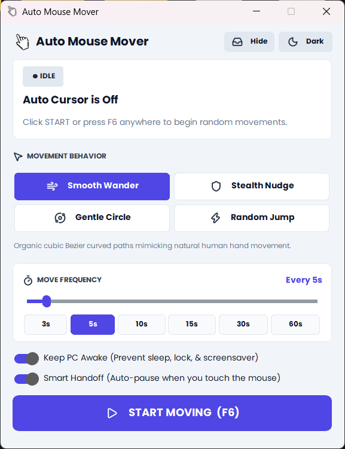
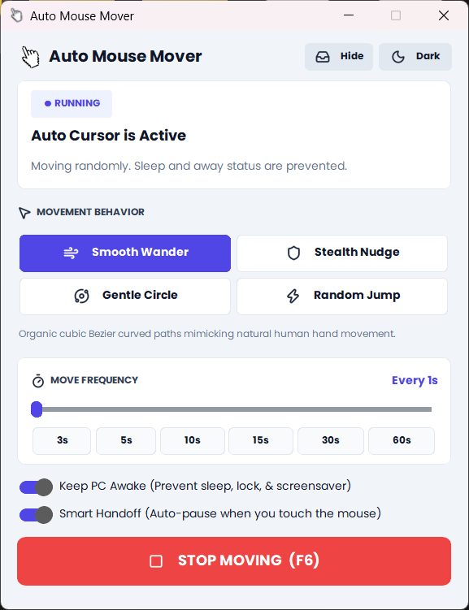
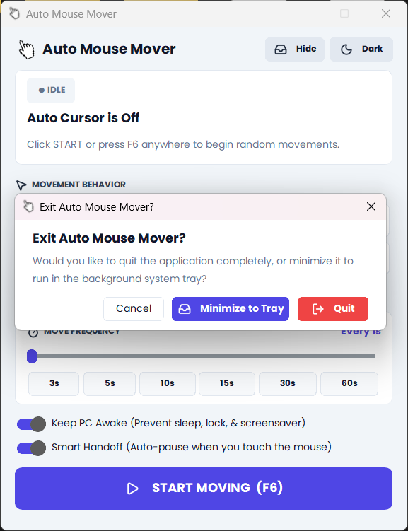

#  Auto Mouse Mover

[](https://github.com/HumayunK01/AutoMouseMover/releases/latest)
[](https://github.com/HumayunK01/AutoMouseMover/releases/latest/download/AutoMouseMover.exe)
[](LICENSE)
[](https://microsoft.com/windows)
[](#)
[](#)
[](#)

> **Looking for a free, safe mouse mover that isn't paid, blocked by corporate firewalls, or requiring admin rights?**  
> Most mouse jigglers on the internet are locked behind subscriptions, packed with ads, or blocked by IT proxies. **Auto Mouse Mover** is a 100% free, open-source, offline Windows utility that simulates natural human cursor motion to keep your PC awake and maintain active status on Teams, Slack, Zoom, and Skype.

---

## 📸 Visual Preview & Workflow

| 1. Idle / Normal State | 2. While Running State | 3. Smart Exit / Tray Dialog |
| :---: | :---: | :---: |
|  |  |  |
| **Configure & Customize**<br>Choose movement modes, interval timers & random jitter | **Active Simulation**<br>Real-time countdown, live move counter & status indicator | **Zero Desktop Clutter**<br>Silently minimize to system tray or quit completely |

---

## 🔍 Frequently Asked Questions (Most Searched Solutions)

### ❓ Why are most mouse movers paid or blocked by corporate firewalls?
Many commercial mouse jigglers on the Microsoft Store or online search results have transitioned to **paid monthly subscriptions**, intrusive advertisements, or closed-source codebases. Worse, many commercial tools connect to external servers for licensing checks, telemetry, or ad networks—which immediately triggers **corporate firewall blocks, proxy alerts, and IT security flags**.

**How Auto Mouse Mover solves this:**
- **100% Free & Open-Source**: MIT-licensed forever. No paywalls, no "pro version" upgrades, no trials.
- **Zero Internet Access**: Operates 100% offline. It makes zero outbound network calls, so it will **never trip corporate firewalls or web filters**.
- **Inspectable Source Code**: Every line of code is open and verifiable right here on GitHub.

---

### ❓ Can IT or employee monitoring software detect mouse movers?
Most basic mouse jigglers get detected because they use **synthetic, repetitive patterns**:
1. **Robotic Linear Motion**: Moving the cursor in straight lines or teleporting back and forth at exact mathematical intervals.
2. **Fixed Time Intervals**: Triggering every 60.00 seconds on the dot, which monitoring algorithms flag as artificial.
3. **Fighting the User**: If you touch your mouse while a dumb script is running, the cursor twitches erratically as you fight the automated script.

**How Auto Mouse Mover stays undetectable:**
- **🌊 Organic Cubic Bézier Curves ("Smooth Wander")**: Uses mathematical Bézier curves with natural acceleration, inertia, deceleration, and curved trajectories that mirror genuine human hand movement.
- **🎲 Randomized Time Jitter**: Introduces customizable random variations between movement cycles so no two intervals are identical.
- **🛡️ Smart User Handoff**: The instant you touch or move your physical mouse, the engine automatically pauses. It never fights your cursor and resumes smoothly once you are idle.
- **🥷 Stealth Micro-Nudge Mode**: Moves the cursor by just 1–2 pixels and back. It resets OS idle timers without moving across your screen, keeping your screen uncluttered during presentations or video calls.

---

### ❓ Can I use this on a work laptop without administrator privileges?
**Yes.** Auto Mouse Mover does not require administrator rights, root privileges, or UAC prompts.
- **No installer needed**: Runs directly as a portable standalone `.exe` or from source via Python.
- **No registry modifications**: Does not write to system-restricted directories or install background services/drivers.
- **User-space execution**: Leverages standard Windows user-space Win32 API calls (`ctypes.windll.user32`).

---

### ❓ How do I keep Microsoft Teams, Slack, Zoom, and Skype active ("Available" / Green)?
Communication apps monitor operating system user idle time. If no hardware or synthetic input events are reported to the OS within your organization's inactivity threshold (typically 5 to 15 minutes), your status automatically flips from **Available (Green)** to **Away (Yellow)**.

Auto Mouse Mover interacts directly with:
1. **Windows Input Subsystem**: Emits real OS-level cursor coordinate updates and zero-delta move events (`MOUSEEVENTF_MOVE`), actively resetting the Windows idle counter (`GetLastInputInfo`).
2. **Thread Execution State API (`SetThreadExecutionState`)**: Signals the Windows kernel (`ES_SYSTEM_REQUIRED | ES_DISPLAY_REQUIRED`) to prevent screen lockouts, display dimming, and sleep timers even under restrictive corporate group policies (GPO).

---

### ❓ Hardware USB Mouse Jiggler vs. Software Mouse Mover: Which is better?

| Feature | Hardware USB Jigglers | Paid Commercial Software | Auto Mouse Mover |
| :--- | :---: | :---: | :---: |
| **Cost** | 💲 $15 – $35 per dongle | 💲 $5 – $15/month subscription | 🆓 **100% Free & Open Source** |
| **Corporate IT USB Audits** | ⚠️ Risky (USB VID/PID logged by endpoint security) | ✅ None | ✅ **Zero Hardware Footprint** |
| **Firewall & Proxy Safe** | ✅ Safe | ❌ Often blocked by corporate firewalls | ✅ **100% Offline (No Telemetry)** |
| **Admin Rights Required** | ✅ No | ⚠️ Sometimes requires installer | ✅ **No Admin Rights Required** |
| **Natural Human Curves** | ❌ Mostly rigid zig-zags | ⚠️ Varies | ✅ **Cubic Bézier Human Paths** |
| **Stealth Micro-Movements** | ❌ Moves cursor visibly | ⚠️ Varies | ✅ **1–2px Invisible Nudge** |
| **Smart User Auto-Pause** | ❌ Fights your hand movements | ⚠️ Rarely supported | ✅ **Instant Auto-Pause on Touch** |
| **Global Hotkeys & Tray** | ❌ Physical button only | ⚠️ Paywalled | ✅ **F6 Global Hotkey + System Tray** |

---

### ❓ Can I hide the app while working or during meetings?
**Yes.**
- **📥 Windows System Tray**: Minimizing or clicking close `[X]` provides an exit prompt allowing you to send the app directly to your Windows notification tray, completely hiding it from the Taskbar and `Alt + Tab` switcher.
- **🚪 Smart Exit Dialog**: Choose whether to keep the mover running silently in the system tray or shut it down completely.
- **⌨️ Global Toggle Hotkey (`F6`)**: Press `F6` from any application, browser, or full-screen window to start or stop the mover instantly without ever bringing the window into view.

---

### ❓ Is Auto Mouse Mover safe and free from malware?
**Yes, 100%.**
- Contains **no ads, no tracking, no analytics, and no cloud dependencies**.
- The entire engine is built using standard Python and transparent Windows API bindings via `ctypes`.
- You can inspect the full source code directly in [`mover_engine.py`](mover_engine.py) and [`app.py`](app.py) or build the binary yourself using PyInstaller.

---

## 🎯 4 Movement Modes Explained

| Mode | What It Does | Best Used For |
| :--- | :--- | :--- |
| **🌊 Smooth Wander** | Traverses organic, curved cubic Bézier paths with acceleration and deceleration. | Maximum natural human simulation; avoiding algorithmic detection. |
| **🥷 Stealth Nudge** | Micro-shifts the cursor 1–2 pixels and immediately returns. | Presentations, reading, watching videos, or working without cursor disruption. |
| **🔄 Gentle Circle** | Smoothly orbits in an elliptical loop around the current position. | Continuous, predictable activity keeping screen displays active. |
| **⚡ Random Jump** | Coordinates randomized jumps across multi-monitor displays. | Testing screen boundaries or keeping multiple virtual desktops awake. |

---

## 📥 Download & Installation

### Option 1: Direct Download (Recommended — No Setup Required)

1. Download **[`AutoMouseMover.exe`](https://github.com/HumayunK01/AutoMouseMover/releases/latest/download/AutoMouseMover.exe)** from the [Latest GitHub Release](https://github.com/HumayunK01/AutoMouseMover/releases/latest).
2. Double-click the downloaded `.exe` to run immediately.
   - **No installation wizard** or setup required.
   - **No administrator permissions** needed.
   - Portable: run it directly from your Downloads, Desktop, or a USB drive.

*(Optional)* Run `CreateDesktopShortcut.bat` to create an official desktop shortcut with the app icon.

---

### Option 2: Run from Source (Python)

If you prefer running directly from source code:

```powershell
# 1. Clone the repository
git clone https://github.com/HumayunK01/AutoMouseMover.git
cd AutoMouseMover

# 2. Set up virtual environment
python -m venv .venv
.venv\Scripts\Activate.ps1

# 3. Install dependencies & launch
pip install -r requirements.txt
python main.py
```
*(Or double-click `run.bat` to launch automatically.)*

---

## ⌨️ Global Shortcuts & Controls

| Shortcut | Function | Context |
| :---: | :--- | :--- |
| **`F6`** | **Global Toggle**: Start / Stop mouse movement | Works from anywhere (even games & background apps) |
| **`Space`** | Toggle Start / Stop | When app window is focused |
| **`Esc`** | Minimize to background System Tray | When app window is focused |

---

## 🛠️ Tech Stack & Architecture

- **GUI Framework**: [CustomTkinter](https://github.com/TomSchimansky/CustomTkinter) with modern dark/light styling and responsive DPI scaling.
- **Vector Graphics**: Official Lucide icon library rendered dynamically.
- **Engine Core**: Native Windows User32 & Kernel32 ctypes bindings:
  - `SetCursorPos` & `mouse_event` for hardware-level event injection.
  - `SetThreadExecutionState` for non-invasive display and sleep prevention.
  - `GetSystemMetrics` with virtual screen support across multi-monitor setups.
- **Packaging**: Self-contained single-file executable built via PyInstaller (`AutoMouseMover.spec`).

---

## 📄 License

This project is licensed under the **[MIT License](LICENSE)**. You are free to use, modify, distribute, and run this application for personal or commercial use without restriction.

